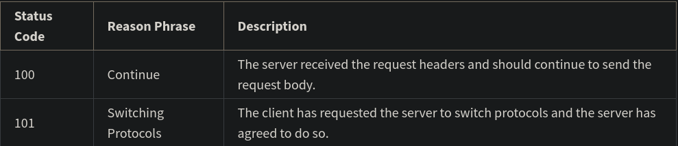
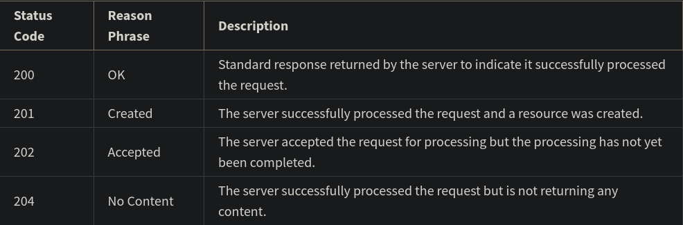
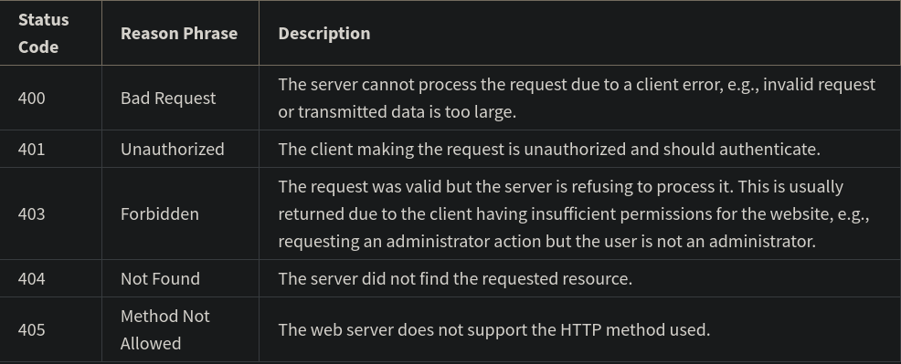
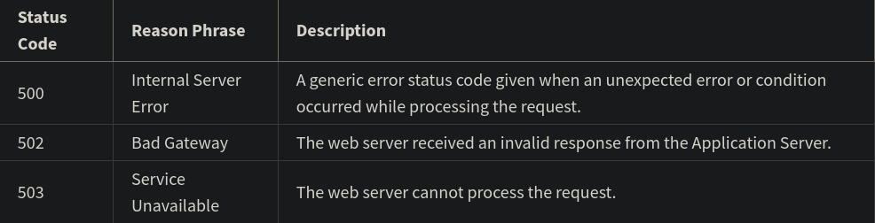

# HyperText Transfer Protocol

HTTPS: HyperText Transfer Protocol Secured (Every request is encrypted into a secret key that only the server can decrypt).

## HTTP Request

### HTTP Request Line

HTTP requests start with request line. Request line consists of the HTTP method, the requested resource and the HTTP protocol version.

```
GET /home.html HTTP/1.1
```

#### Methods

HTTP methods indicate the action that the client wishes to perform on the web server resource.

1.  GET : The client requests a resource on the web server.
2.  POST : The client submits data to a resource on the web server.
3.  PUT : The client replaces a resource on the web server.
4.  DELETE : The client deletes a resource on the web server.

### HTTP Request Headers

After the request line, the HTTP headers are followed by a line break.

```
Host: example.com
User-Agent: Mozilla/5.0 (Macintosh; Intel Mac OS X 10.9; rv:50.0) Gecko/20100101 Firefox/50.0
Accept: */*
Accept-Language: en
Content-type: text/json
```

- The Host header specifies the host of the server and indicates where the resource is requested from.
- The User-Agent header informs the web server of the application that is making the request. It often includes the operating system (Windows, Mac, Linux), version and application vendor.
- The Accept header informs the web server what type of content the client will accept as the response.
- The Accept-Language header indicates the language and optionally the locale that the client prefers.
- The Content-type header indicates the type of content being transmitted in the request body.

### HTTP Request Body

HTTP requests can optionally include a request body. A request body is often included when using the HTTP POST and PUT methods to transmit data.

```
POST /users HTTP/1.1
Host: example.com

{
 "key1":"value1",
 "key2":"value2",
 "array1":["value3","value4"]
}
```

## HTTP Response

When the web server is finished processing the HTTP request, it will send back an HTTP response.

The first line of the response is the status line. This line shows the client if the request was successful or if an error occurred.

```
HTTP/1.1 200 OK 
```

The line begins with the HTTP protocol version, followed by the status code and a reason phrase. The reason phrase is a textual representation of the status code.

### HTTP Status Codes

The first digit of an HTTP status code indicates the category of the response: Information, Successful, Redirection, Client Error or Server Error.

#### 1XX Informational



#### 2XX Successful



#### 3XX Redirection


#### 4XX Client Error



#### 5XX Server Error



### HTTP Response Headers

Following the status line, there are optional HTTP response headers followed by a line break.

```
Date: Fri, 11 Feb 2022 15:00:00 GMT+2
Server: Apache/2.2.14 (Linux)
Content-Length: 84
Content-Type: text/html
```

- The Date header specifies the date and time the HTTP response was generated.
- The Server header describes the web server software used to generate the response.
- The Content-Length header describes the length of the response.
- The Content-Type header describes the media type of the resource returned (e.g. HTML document, image, video).

### HTTP Response Body

Following the HTTP response headers is the HTTP response body. This is the main content of the HTTP response.

This can contain images, video, HTML documents and other media types.

```
HTTP/1.1 200 OK
Date: Fri, 11 Feb 2022 15:00:00 GMT+2
Server: Apache/2.2.14 (Linux)
Content-Length: 84
Content-Type: text/html

<html>
  <head><title>Test</title></head>
  <body>Test HTML page.</body>
</html>
```