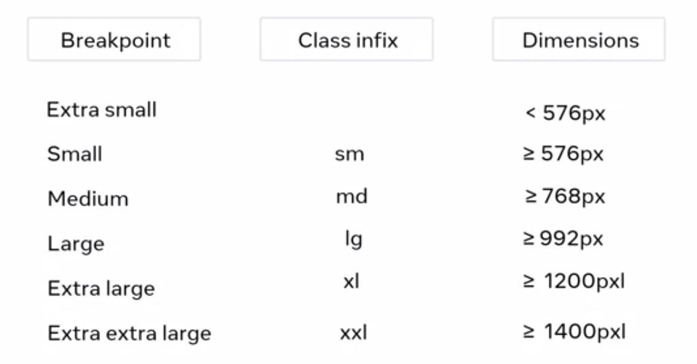
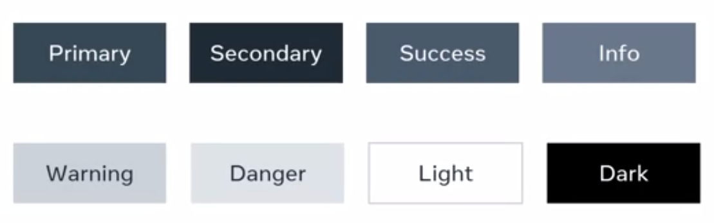

# Bootstrap Framework
Bootstrap is a collection of libraries or a framework that simplifies the process of designing webpages by providing the developer with sets f pre-written code in CSS and JS.

Bootstrap has infixies and modifiers that we will use for responsive design.
Monitor size in Bootstrap has several breakpoints.

We can use 8 modifiers to achieve different colors and styles:

