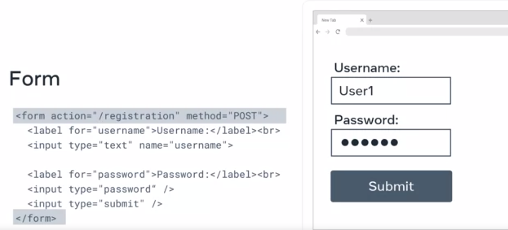

# HTML - HyperText Markup Language

HTML is the structure that other parts of the website are built upon.
HTML consists of tags and elements that will later on be styled using CSS (Cascading StyleSheets).

## Useful HTML Tags
There are infinite HTML tags, but we'll learn them all on a need-to basis. Basic HTML tags are:

### Headings
```html
  <h1>Heading 1</h1>
  <h2>Heading 2</h2>
  <h3>Heading 3</h3>
  <h4>Heading 4</h4>
  <h5>Heading 5</h5>
  <h6>Heading 6</h6>
```

### Paragraphs and Line Breaks

```html
<p>
   This paragraph contains a lot of lines but they are ignored.


   This paragraph<br>
   contains a lot of lines<br>
   and they are displayed.
</p>
```

### Text Styles:
#### Strong
```html
   No matter how much the dog barks: <strong>don't feed him chocolate</strong>.
```
#### Bold
```html
   The primary colors are <b>red</b>, <b>yellow</b> and <b>blue</b>.
```
#### Emphasis
```html
   Wake up <em>now</em>!
```
#### Italics
```html
   The term <i>HTML</i> stands for HyperText Markup Language.
```
### Lists
```html
<ul>
   <li>Tea</li>
   <li>Sugar</li>
   <li>Milk</li>
</ul>

<ol>
   <li>Rocky</li>
   <li>Rocky II</li>
   <li>Rocky III</li>
</ol>
```

### Table
```html
<table>
	<tr>
		<th>Header 1</th>
		<th>Header 2</th>
	</tr>
	<tr>
		<td>Data 1</td>
		<td>Data 2</td>
	</tr>
	<tr>
		<td>SubData 1</td>
		<td>SubData 2</td>
	</tr>
</table>
```

### Forms


```html
<form action="/registration" method="POST">
	<label for="username">Username:</label><br>
	<input type="text" name="username">
	
	<label for="password">Password:</label><br>
	<input type="password">
	<input type="submit">
</form>
```
## Additional Information
Here is a list of resources that may be helpful as you continue your learning journey.

1. HTML Elements Reference (Mozilla)
https://developer.mozilla.org/en-US/docs/Web/HTML/Element

2. The Form Element (Mozilla)
https://developer.mozilla.org/en-US/docs/Web/HTML/Element/form

3. What is the Document Object Model? (W3C)
https://www.w3.org/TR/WD-DOM/introduction.html

4. ARIA in HTML (W3C via Github)
https://w3c.github.io/html-aria/

5. ARIA Authoring Practices  (W3C)
https://www.w3.org/TR/wai-aria-practices-1.2/