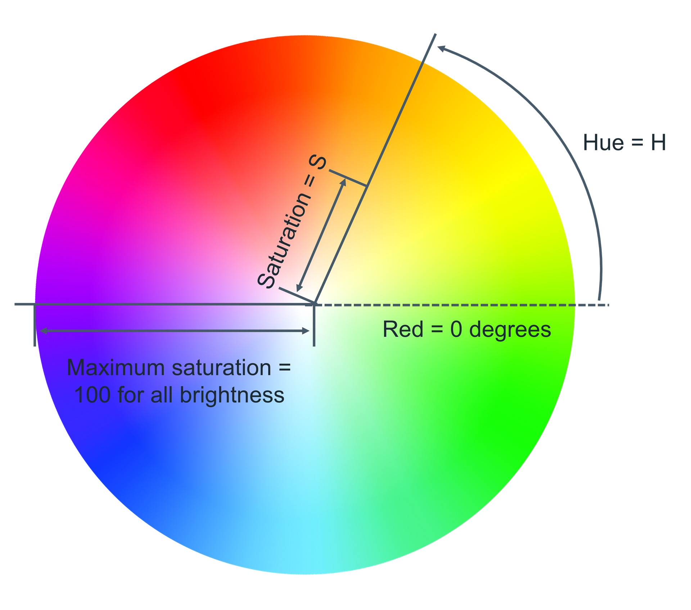
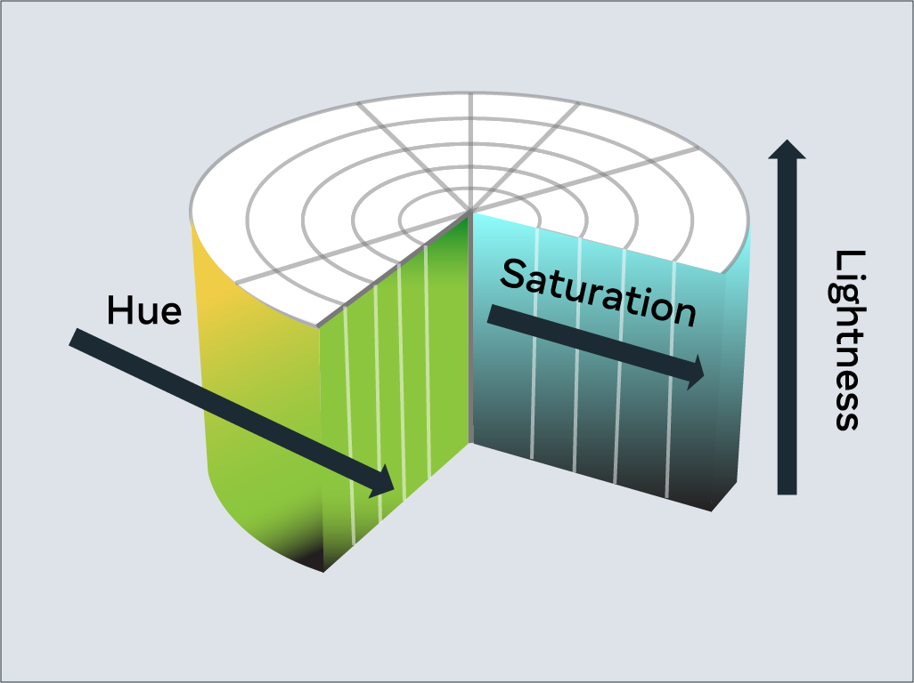
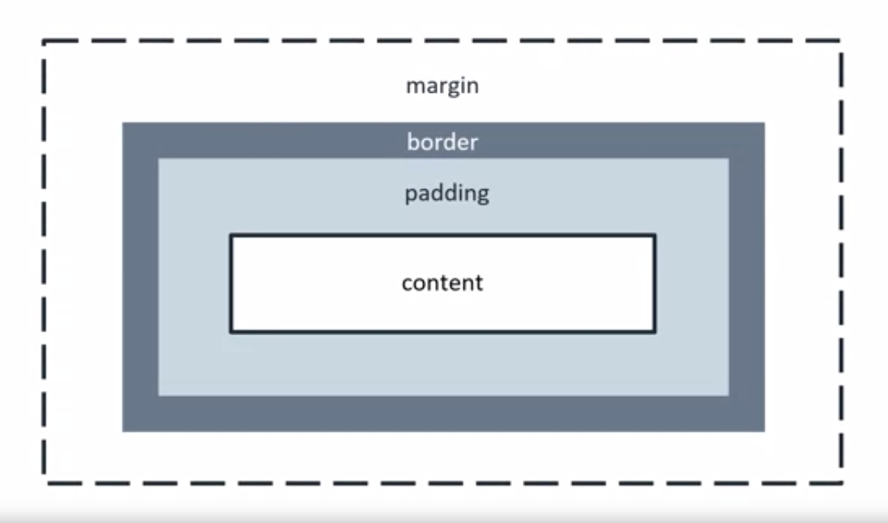

# CSS - Cascading StyleSheets
CSS is the frontend to the HTML and is used for styling the structure previously built.
A CSS rule is as follows:

```css
selector {
	property: value;
}
```

## Selectors
When styling a web page, there are many types of selectors available that allow developers to be as broad or as specific as they need to be when selecting HTML elements to apply CSS rules to.

### Element Selectors
The element selector allows developers to select HTML elements based on their element type.

HTML:
```html
<p>Once upon a time...</p>
<p>In a hidden land...</p>
```
CSS:
```css
p { 
  color: blue; 
}
```
### ID Selectors
The ID selector uses the id attribute of an HTML element. Since the id is unique within a webpage, it allows the developer to select a specific element for styling. ID selectors are prefixed with a # character.

HTML:
```html
<span id="latest">New!</span>
```
CSS:
```css
#latest { 
  background-color: purple; 
}
```
### Class Selectors
Elements can also be selected based on the class attribute applied to them. The CSS rule has been applied to all elements with the specified class name. The class selector is prefixed with a . character.

In the following example, the CSS rule applies to both elements as they have the navigation CSS class applied to them.

HTML:
```html
<a class="navigation">Go Back</a>
<p class="navigation">Go Forward</p>
```
CSS:
```css
.navigation { 
  margin: 2px;
}
```
### Element with Class Selector
A more specific method for selecting HTML elements is by first selecting the HTML element, then selecting the CSS class or ID. The example below selects all p elements that have the CSS class introduction applied to them.

HTML:
```html
<p class="introduction"></a>
```
CSS:
```css
p.introduction { 
  margin: 2px;
}
```
### Descendant Selectors
Descendant selectors are useful if you need to select HTML elements that are contained within another selector. In the example below, the CSS rule will select all h1 elements that are contained within the element with the ID blog. The CSS rule will not apply to the h1 element containing the text Archives.

The structure of a descendant selector is a CSS selector, followed by a single space character, followed by another CSS selector.

Multiple descendants can also be selected. For example, to select all h1 elements that are descendants of div elements which are descendants of the blog element, the selector is specified as the second CSS code below.

HTML:
```html
<div id="blog">
  <h1>Latest News</h1>
  <div>
    <h1>Today's Weather</h1>
    <p>The weather will be sunny</p>
  </div>
  <p>Subscribe for more news</p>
</div>
<div>
  <h1>Archives</h1>
</div>
```
CSS:
```css
#blog h1 {
  color: blue;
}
```
CSS for multiple descendants:
```css
#blog div h1 {
  color: blue;
}
```
### Child Selectors
Child selectors are more specific than descendant selectors. They only select elements that are immediate descendants (children) of a selector (the parent).

HTML:
```html
<div id="blog">
  <h1>Latest News</h1>
  <div>
    <h1>Today's Weather</h1>
    <p>The weather will be sunny</p>
  </div>
  <p>Subscribe for more news</p>
</div>
```
If you wanted to style the h1 element containing the text Latest News, you can use the following child selector:

CSS:
```css
#blog > h1 {
  color: blue;
}
```
This will select the element with the ID blog (the parent), then it will select all h1 elements that are contained directly in that element (the children). The structure of the child selector is a CSS selector followed by the child combinator symbol > followed by another CSS selector.

**Note** that this will not go beyond a single depth level. Therefore, the CSS rule will not be applied to the h1 element containing the text Today's Weather.
### :hover Pseudo-Class
A special keyword called a pseudo-class allows developers to select elements based on their state. Don't worry too much about what that means right now. For now, let's look at how the hover pseudo-class allows you to style an element when the mouse cursor hovers over the element.

The simplest example of this is changing the color of a hyperlink when it is hovered over. To do this, you add the :hover pseudo-class to the end of the selector. In the following example, adding :hover  to the a element will change the color of the hyperlink to orange when it is hovered over.

CSS:
```css
a:hover {
  color: orange;
}
```
This pseudo-class is very useful for creating visual effects based on user interaction.

## Text and Colors
There are many different ways to display text and equally as many ways to define colors.
### color
Colors are used in many CSS properties, for example:
```css
p { 
  color: blue; 
}
```
From CSS Version 3, there are five main ways to reference a color.
+ By RGB value,
+ By RGBA value,
+ By HSL value,
+ By hex value and
+ By predefined color names.

#### RGB Value
RGB is a color model that adds the colors red (R), green (G) and blue (B) together to create colors. This is based on how the human eye sees colors.

Each value is defined as a number between 0 and 255, representing the intensity of that color.

For example, the color red would have the RGB value of 255,0,0 since the intensity of the red color would be 100% while blue and green would be 0%. The color black then would be 0,0,0 and the color white 255,255,255.

When using RGB values in CSS, they can be defined using the rgb keyword:
```css
p { 
  color: rgb(255, 0, 0); 
}
```
#### RGBA Value
RGBA is an extension of RGB that add an alpha (A) channel. The alpha channel represents the opacity, or transparency, of the color.

Similar to RGB, this is specified in CSS using the rgba keyword:
```css
p { 
  color: rgba(255, 0, 0, 128); 
}
```
### HSL Value
HSL is a newer color model defined as Hue (H), Saturation (S) and Lightness (L). The aim of the model is to simplify mental visualization of the color that the value represents.

Think of a rainbow that has been turned into a full circle. This represents the Hue. The Hue value is the degree value on this circle, from 0 degrees to 360 degrees. 0 is red, 120 is green and 240 is blue.



Saturation is the distance from the center of the circle to its edge. The saturation value is represented by a percentage from 0% to 100% where 0% is the center of the circle and 100% is its edge. For example, 0% will mean that the color is more grey and 100% represents the full color.

Lightness is the third element of this color model. Think of it as turning the circle into a 3D cylinder where the bottom of the cylinder is more black and toward the top is more white. Therefore, lightness is the distance from the bottom of the cylinder to the top. Again, lightness is represented by a percentage from 0% to 100% where 0% is the bottom of the cylinder and 100% is its top. In other words, 0% will mean that the color is more black and 100% is white.



In CSS, you use the hsl keyword to define a color with HSL.
```css
p { 
  color: hsl(0, 100%, 50%);
}
```
#### HEX Value
Colors can be specified using a hexadecimal value. If you're unfamiliar with hexadecimal, think of it as a different number set.

Decimal is what you use every day. Digits range from 0 to 9 before tens and hundreds are used.

Hexadecimal is similar, except it has 16 digits. This is counted as 0, 1, 2, 3, 4, 5, 6, 7, 8, 9, A, B, C, D, E, F.

In fact, you can convert between decimal and hexadecimal. Decimal 10 is equal to hexadecimal A. Hexadecimal F is equal to decimal 15. Hexadecimal can also go to tens and hundreds. For example, decimal 16 is equal to hexadecimal 10, with 10 being the next number after F.

Colors specified using hexadecimal are prefixed with a # symbol followed by the RGB value in hexadecimal format. For example, the color red which is RGB 255,0,0 would be written as hexadecimal #FF0000.
#### Predefined Color Names
Modern web browsers support 140 predefined color names. These color names are for convenience purposes and can be mapped to equivalent hex/RGB/HSL values.
```css
black
silver
gray
white
maroon
red
purple
fuchsia
green
lime
olive
yellow
navy
blue
teal
aqua
```

### Text
With CSS there are many ways to change how text is displayed. In this section, you'll learn the most common text manipulation CSS properties.
#### Text Color
The color property sets the color of text. The following CSS sets the text color for all paragraph elements to red.
```css
p { 
  color: red;
}
```
#### Text Font and Size
There are many different fonts to display text on your computer. In simple terms, a font is a collection of text characters written in a specific style and size.

To set the font used by text in CSS you use the font-family property.
```css
p { 
  font-family: "Courier New", monospace;
}
```
Since computers vary in what fonts they have installed, it is recommended to include several fonts when using the font-family property. These are specified in a fallback order, meaning that if the first font is not available, it will check for the second font. If the second font is not available, then it will check for the third font and so on. If none of the fonts are available, it will use the browser's default font.

To set the size of the font, the font-size property is used.
```css
p { 
  font-family: "Courier New", monospace;
  font-size: 12px;
}
```
#### Text Transformation
Text transformation is useful if you want to ensure the correct capitalization of the text content. In the example below, the CSS rule will change all text in paragraph elements to uppercase using the text-transform property:
```css
p { 
  text-transform: uppercase;
}
```
The most commonly used values for the text-transform property are:  uppercase,  lowercase,  capitalize  and none. The default value used is none, which means the text displays as it was written in the HTML document.
#### Text Decoration
The text-decoration property is useful to apply additional decoration to text such as underlining and line-through (strikethrough).
```css
p { 
  text-decoration: underline;
}
```
It is possible to set the color, thickness and styling of the decoration too. In the example below, the underline will be a solid red line that is 5 pixels thick.
```css
p { 
  text-decoration: underline red solid 5px;
}
```
If this is confusing, don't worry. These properties can be individually set using the text-decoration-line, text-decoration-color, text-decoration-style and text-decoration-thickness properties. Let's use the same example again and define it using the individual properties:
```css
p { 
  text-decoration-line: underline;
  text-decoration-color: red;
  text-decoration-style: solid;
  text-decoration-thickness: 5px;
}
```
The most common text-decoration-line values used are: underline, overline, line-through and none. None is the default value to use no text decoration.

There are many styles available for the text-decoration-style  property;  solid,  double,  dotted,  dashed  and  wavy. The text-decoration-style property requires the decoration line to be defined. If the decoration style is not specified, solid will be used.

## Box Model


## Block and Inline
Blocks fill up the entire width of the page and the height of their content. They also start on a new line.
Inline doesn't start on a new line and takes up the width and height of its content.
### Common Block Elements
+ div
+ form
+ headings

### Common Inline Elements
+ a
+ img
+ input
+ label
+ strong
+ b
+ i
+ em
+ span
