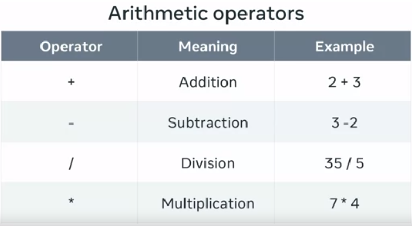
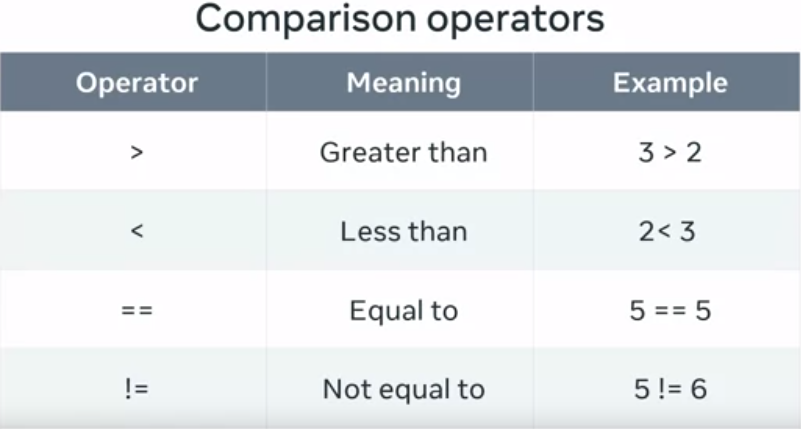
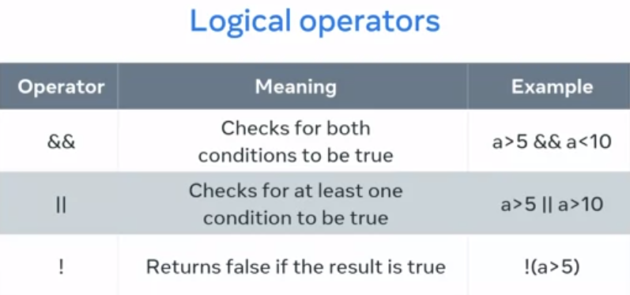

# Assignment and Logical Operators

Assignment operator or `=` is used to assign a value to a variable.

## Arithmetic Operators

We can do many arithmetic operations in JavaScript using `+`, `-`, `*`, and `/` which all work as they do in mathematics.

## Comparison Operators

There are also comparison operators that compare two or more values and result in true or false.

## Logical Operators

Logical operators are used to check for logical comparison. The most used ones are AND, OR, and NOT.

